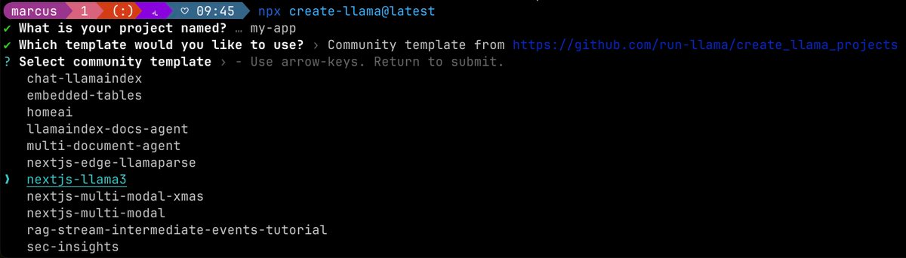

# AIBUDDY
```
nextjs-llama3: Use Llama3 with LlamaIndex to create a RAG application
https://github.com/run-llama/create_llama_projects/blob/main/nextjs-llama3/README.md
https://github.com/run-llama/LlamaIndexTS
pnpm create llama@latest
✔ What is your project named? … aibase
✔ Which template would you like to use? › Community template from https://github.com/run-llama/create_llama_projects
nextjs-llama3
```

```
----------------------
cd aibuddy && pnpm install
----------------------
```
# AIBASE
```
pnpm create llama@latest
../../Library/pnpm/store/v3/tmp/dlx-5276 |   +1 +
../../Library/pnpm/store/v3/tmp/dlx-5276 | Progress: resolved 1, reused 1, downloaded 0, added 1, done
✔ What is your project named? … aibase
✔ Which template would you like to use? › Chat
✔ Which framework would you like to use? › FastAPI (Python)
✔ Would you like to generate a NextJS frontend for your FastAPI (Python) backend? … No / Yes
✔ Please provide your OpenAI API key (leave blank to skip): … 
✔ Which model would you like to use? › gpt-3.5-turbo-0125
✔ Which embedding model would you like to use? › text-embedding-ada-002
✔ Which data source would you like to use? › Use an example PDF
✔ Would you like to add another data source? › Use local files (.pdf, .doc, .docx, .xls, .xlsx, .csv)
✔ Would you like to add another data source? › No
✔ Would you like to use LlamaParse (improved parser for RAG - requires API key)? … no / yes
✔ Please provide your LlamaIndex Cloud API key (leave blank to skip): … llx-u4AjuVD7BESlKHO8Rwxi0PfJz6NfzyhYWZbwPDx6knUtZFyy
✔ Would you like to use a vector database? › No, just store the data in the file system
✔ Would you like to build an agent using tools? If so, select the tools here, otherwise just press enter › Google Search (configuration required after installation)
✔ How would you like to proceed? › Start in VSCode (~1 sec)
Creating a new LlamaIndex app in /Users/jgomezhernandez/Projects/aigen-llm-poc/aibase.


Initializing Python project with template: streaming 


Added docx2txt, llama-index-tools-google, docx2txt, llama-index-tools-google to pyproject.toml

Created '.env' file. Please check the settings.


---------
Urls for API keys

OPENAI_API_KEY
https://platform.openai.com/api-keys
----------------------
`REPLICATE_API_TOKEN` from https://replicate.com/account/api-tokens
----------------------
 LlamaParse (improved parser for RAG - requires API key
https://cloud.llamaindex.ai/api-key
----------------------
ANTHROPIC_API_KEY(claude)
-----------------------
```